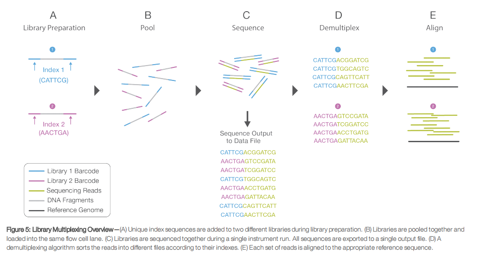

scATAC-seq index designer
============================================================
Time-stamp: "2017-11-01 14:57:52"

# Two round barcoding multiplex
 From [An Introduction to Next-Generation Sequencing Technology](https://www.illumina.com/content/dam/illumina-marketing/documents/products/illumina_sequencing_introduction.pdf) by Illumina. 

# Requirements for a barcodes design

* `-d`: Hamming distance between every two barcodes >=4(of 8bp): for possible sequencing error 
* `-gmax` and `gmin`: GC content 37.5-62.5% : for sequencer 
* `-n`: max number of repeat bps [3]

# Algorithm 


# Usage

``` Shell
$chmod u+x scATAC_index_designer
$scATAC_index_designer -h
```

``` Shell
 Usage: scATAC_index_designer [-h] [-l LEN] [-d DIST] [-o FNAME] [-gmax GC_MAX] [-gmin GC_MIN] [-n NUM_REPEAT] [-s SED]
 
 Barcode Design for scATAC.
 
 Options:
   -h, --help            show this help message and exit
   -l LEN                barcode length [8].
   -d DIST               min pair-wise distance between two generated barcodes.
   -a GC_MAX, --gmax=GC_MAX
                         max gc content.
   -i GC_MIN, --gmin=GC_MIN
                         min gc content.
   -n NUM_REPEAT         max repeat letters allowed.
   -s SED                sed barcodes to start with.
   -o FNAME              output file.
```

``` Shell
$scATAC_index_designer -l 8 -d 4 -o i7.4mm.txt --gmax 0.625 --gmin 0.375  -n 3
scATAC_index_designer -l 8 -d 4 -o ./examples/idx.4mm.txt --gmax 0.625 --gmin 0.375  -n 3  -s ./examples/old.txt
```
